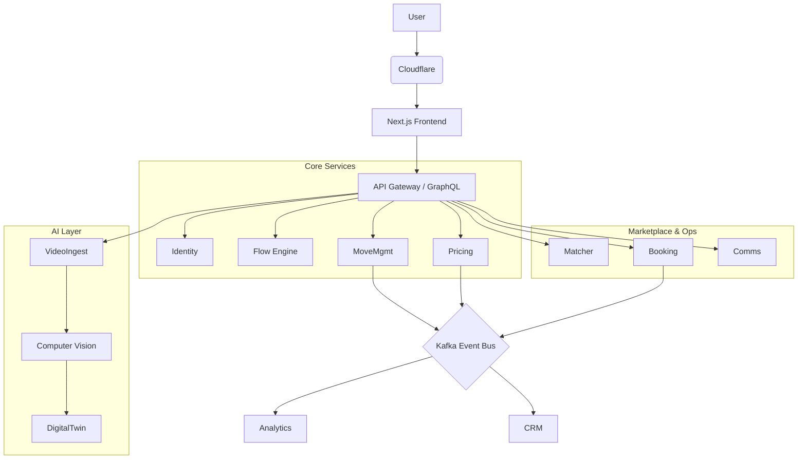

# Relocation Operating System (Relo-OS) Blueprint

> **Vision**: To erase the friction of relocation so completely that moving feels like teleportation.
> **Category**: From Lead Aggregator → Relocation Operating System

---

## (1) NORTH STAR

### Vision Statement
We do not sell "offers"; we sell the immediate restoration of **Feierabend** (rest/peace) in a new home. We transform high-stress analog chaos into a single, invisible, guaranteed digital transaction.

### Category Definition

| Old Category | New Category |
|--------------|--------------|
| **Lead Aggregators** (Movu, Renovero) | **Relocation Operating System (Relo-OS)** |
| Sell user data to vendors → noise, spam, price wars | Own the outcome, not just the introduction |
| No quality guarantee | AI-digitized inventory → instant guaranteed fixed price |
| "Getting quotes" | "Booking a move" |

### North Star Metric (NSM)

**Perfect Moves Delivered (PMD)**
- 0 damage claims
- On-time arrival
- <1 hour of customer administrative effort total

### Input Metrics

| Metric | Target | Description |
|--------|--------|-------------|
| Trust Velocity | <120 sec | Time from landing to video upload |
| AI Accuracy | >95% | Items correctly identified by CV |
| Supply Liquidity | >3 providers | Gold Tier providers per ZIP next-day |
| Conversion Rate | >8% | Visit to Escrow Deposit (industry avg: 2%) |
| Anxiety Reduction | NPS 70+ | "Peace of Mind" question score |

---

## (2) USER ARCHETYPES & JOBS-TO-BE-DONE

### Archetype 1: The Overwhelmed Professional
**Lukas, 34, Zürich**
- **Context**: Changing jobs, no time, hates phone calls
- **JTBD**: "Help me switch homes without interrupting my work week"
- **Anxiety**: "I don't have time to supervise movers. What if they don't show up?"
- **Trust Trigger**: Instant fixed price via AI video; no spam calls

### Archetype 2: The Family Manager
**Sarah, 41, Bern**
- **Context**: Moving with 2 kids, managing household mental load
- **JTBD**: "Manage the logistics safely so my children aren't traumatized"
- **Anxiety**: Hidden costs and damage to belongings
- **Trust Trigger**: "Abgabegarantie" + Background-checked staff

### Archetype 3: The Silver Downsizer
**Hans, 72, Luzern**
- **Context**: Moving from house to flat, emotional attachment
- **JTBD**: "Help me sort and transport my life's possessions with dignity"
- **Anxiety**: Scams, roughness with heirlooms, physical strain
- **Trust Trigger**: Personal concierge (human-in-the-loop) + "Swissness" certification

### Archetype 4: The Expat Transfer
**Elena, 29, Geneva**
- **Context**: New to CH, doesn't know rules
- **JTBD**: "Navigate Swiss bureaucracy and housing rules for me"
- **Anxiety**: Being ripped off; Landlord rejecting cleaning
- **Trust Trigger**: English-first UI, eUmzugCH integration

---

## (3) END-TO-END "INVISIBLE MOVE" JOURNEY

### Phase 1: The "Magical" Scan (Zero-UI)
**Goal**: Capture inventory without a form

| Friction | Solution |
|----------|----------|
| Tedious box counting lists | AI Video Scan - user walks through rooms |

- **UI**: "Point and walk. We do the math." AR overlay with scanning bubbles
- **Data**: Video stream, GPS, LiDAR depth
- **Event**: `inventory_scan_completed`

### Phase 2: The Instant Truth (Pricing)
**Goal**: Instant, guaranteed price - no "estimates"

| Friction | Solution |
|----------|----------|
| Waiting 24h for 5 different PDFs | Dynamic Pricing Engine |

- **UI**: Checkout-style. "Fixed Price: CHF 1'450. Guaranteed." Apple Pay
- **Tiers**: Essential, Comfort, Premium
- **Event**: `quote_viewed`, `checkout_initiated`

### Phase 3: The Escrow Lock (Booking)
**Goal**: Commitment without risk

| Friction | Solution |
|----------|----------|
| Fear of paying upfront | Smart Escrow - funds released only after "Job Done" |

- **UI**: "Your money stays safe until you are happy."
- **Split**: 20% deposit, 80% in escrow
- **Event**: `booking_confirmed`

### Phase 4: The Invisible Execution (Moving Day)
**Goal**: Transparency during the black box

| Friction | Solution |
|----------|----------|
| "Where is the truck?" | Uber-style GPS Tracking |

- **UI**: "Captain Walaski is 5 min away." Photo proof of packing
- **Data**: Telematics, timestamps
- **Event**: `move_started`, `move_completed`

### Phase 5: The "Feierabend" (Settling)
**Goal**: Instant relief

| Friction | Solution |
|----------|----------|
| Cleaning handover anxiety | Handover Protocol Integration |

- **UI**: "Landlord accepted apartment. Deposit released. Welcome home."
- **Event**: `handover_success`, `review_submitted`

---

## (4) FUNNEL & FLOW ENGINE

### Flow DSL (JSON Schema)
```json
{
  "flow_id": "v9_video_first_zurich",
  "steps": [
    {
      "id": "welcome",
      "type": "info_card",
      "content": "Dein Umzug in 5 Minuten gebucht.",
      "next": "video_scan_intro"
    },
    {
      "id": "video_scan_intro",
      "type": "camera_capture",
      "overlay": "ar_room_scan",
      "ai_processing": "inventory_v2",
      "fallback": "manual_list_v1"
    }
  ]
}
```

### Experiment Router
| Traffic | Flow Type |
|---------|-----------|
| 70% | Default (Best performing) |
| 20% | Challenger A (Chat-based) |
| 10% | Radical B (Price-first) |

### Segmentation Strategy
- **Mobile** → Force Camera Flow
- **Desktop** → Fallback Wizard Flow
- **Zürich** → Speed focus, higher price tolerance
- **Rural Aargau** → Price sensitivity focus

---

## (5) PRODUCT ARCHITECTURE



### Key Domains
- **Digital Twin Capture**: 3D metadata of user's home
- **Auto-Admin**: eUmzugCH API, address changes
- **Claims**: Dispute resolution with photo evidence

---

## (6) DATA MODEL & API

### Core Entities
```
MoveProject (ID, UserID, Origin, Destination, Date, Status)
InventoryAsset (ID, MoveID, Type, Volume_m3, Fragility_Score, Image_Ref)
Offer (ID, MoveID, ProviderID, Fixed_Price, Expiry)
EscrowTransaction (ID, Stripe_Ref, Release_Conditions)
```

### Public API (Partners)
```
GET  /v1/market/leads     # Filtered by capability/region
POST /v1/market/bid       # Automated bidding
WEBHOOK event.move.confirmed
```

### Provider Anonymization
Bid packages strip exact address/PII. Only visible:
- ZipOrigin, ZipDest
- Volume, Floor, Lift

---

## (7) AI & CV STRATEGY

### Short-term (MVP): "Cyborg Approach"
1. User uploads video
2. AI extracts keyframes, identifies large objects
3. Human-in-the-loop verifies within 10 minutes
4. User perceives "Instant AI" with human accuracy

### Mid-term: Semi-Automated
- Fine-tuned YOLO/EfficientDet on "Swiss Household Objects"
- USM Haller, IKEA PAX, cellar clutter recognition
- Auto-calculation of disassembly time

### Long-term: LiDAR/AR Digital Twin
- Full 3D apartment reconstruction
- "Virtual Truck Loading" - AI simulates optimal packing
- Exact vehicle size selection

---

## (8) BUILD PLAN

### Weeks 1-4: Foundation (MVP)
| Week | Focus |
|------|-------|
| W1 | Scaffold Architecture, Auth, Flow Engine |
| W2 | Video Upload + Manual Inventory fallback |
| W3 | Stripe Connect + Basic Escrow |
| W4 | Wizard Funnel + Admin Dashboard |

### Weeks 5-8: Intelligence
| Week | Focus |
|------|-------|
| W5 | Human-in-the-loop Video Review tool |
| W6 | Dynamic Pricing Engine (rule-based) |
| W7 | Provider Portal (Accept/Reject leads) |
| W8 | Alpha Launch (Friends & Family) |

### Weeks 9-12: Polish & AI
| Week | Focus |
|------|-------|
| W9 | AI Model V1 (Object detection) |
| W10 | "Abgabegarantie" Workflow |
| W11 | Notifications (SMS/WhatsApp) |
| W12 | Public Beta Launch |

---

## (9) OPERATIONS & MARKETPLACE

### Provider Verification ("Swiss Standard")
**Gatekeeping**: Only top 20% of providers

| Requirement | Details |
|-------------|---------|
| Commercial Register | Verified |
| Transport License | Valid |
| Insurance | >CHF 5M |
| ASTAG Membership | Preferred |
| Anti-Scam | Security bond or withheld % on first 5 jobs |

### Escrow Logic
1. **Booking**: User pays 100% to Stripe Connect Platform
2. **Hold**: Funds in "Pending" state
3. **Release Triggers**:
   - 50% on Moving Day (Start)
   - 50% after 48h (if no claim)
4. **Dispute**: User clicks "Problem" → Funds freeze → Team reviews pre/post photos

---

## (10) GROWTH ENGINE

### SEO: Programmatic Local Pages
- Generate 2,000+ pages: `/umzug-[city]-[canton]`
- Template: "Moving in [City]? Average cost: CHF X. Canton rules. Best movers."
- Goal: Capture "Umzugfirma [City]" queries

### Conversion Optimization
- **Trust Badge**: "Verified by Umzugscheck"
- **Copy**: "Umzug in 5-10 Minuten fix gebucht"
- **FOMO**: "3 Movers available for your date"

### Lifecycle CRM
| Timing | Action |
|--------|--------|
| T-4 weeks | Free packing boxes voucher |
| T-1 week | eUmzug reminder |
| T+1 day | Rate provider to release funds |
| T+1 month | Cross-sell (painter, internet) |

---

## (11) SELF-IMPROVING LOOP

### Optimization Engine
- **Input**: Drop-off rates, video errors, price rejection
- **Process**: Weekly Growth Review
- **Output**: Automated A/B tests

### Experiment Governance
Every change needs a hypothesis:
> "If we remove 'Phone Number' from step 1, conversion to Step 2 will increase by 15%."

### Guardrails
- **Trust > Conversion**: No dark patterns
- **Privacy First**: AI training data anonymized, deleted after X days

---

## COPY EXAMPLES

**German**: "Ihr Umzug. Kein Stress. Kein Risiko. Nur Feierabend."

**English**: "Your Move. No Stress. No Risk. Just Relax."

---

*Last Updated: January 2026*
